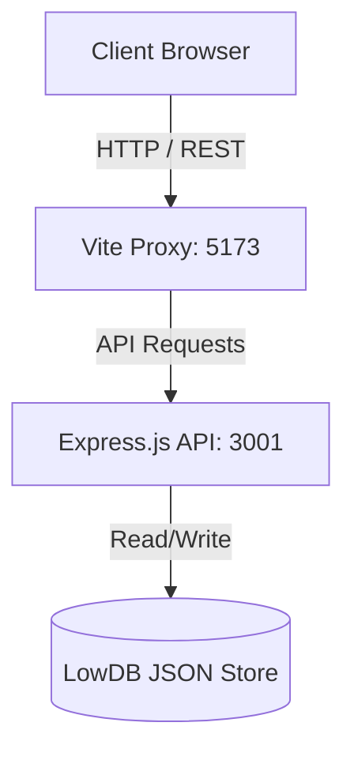

<div align="center">

# TaskFlow Pro

**A next-generation productivity ecosystem and task management platform.**

[](#)
[](LICENSE)
[](#)
[](#)
[](#)
[](#)

TaskFlow Pro merges industrial-grade security with a fluid, futuristic interface. Built for developers, designers, and high-performance teams to orchestrate their workflows seamlessly.

[Features](#-key-features) •
[Architecture](#-architecture) •
[Installation](#-getting-started) •
[Roadmap](#-roadmap)

</div>

---

## Key Features

TaskFlow Pro goes beyond a simple to-do list, offering a comprehensive suite of tools designed to boost deep work and operational efficiency.

### Enterprise-Grade Security
* **JWT Authentication:** Secure, stateless, and persistent user sessions.
* **Bcrypt Cryptography:** Zero-knowledge architecture where passwords are mathematically hashed before reaching the database.
* **Isolated Workspaces:** Strict middleware protection ensures full multi-tenant data isolation.

### State-of-the-Art Interface
* **Glassmorphism Design System:** A translucent, immersive aesthetic leveraging `backdrop-blur` and ambient lighting effects.
* **Dynamic Theming:** Deeply integrated Light and Dark modes utilizing Tailwind CSS v4 variants, adapting seamlessly to your environment.
* **Fluid Micro-interactions:** Cinematic layout transitions and drag-and-drop physics powered by **Framer Motion**.

### Core Productivity Engine
* **Interactive Kanban Board:** Visualize your workflow and intuitively drag-and-drop tasks across custom columns.
* **Advanced Pomodoro Timer:** A customizable, visually rich focus timer to manage work sprints and breaks effectively.
* **Real-time Analytics:** A comprehensive dashboard tracking productivity metrics, completion rates, and priority distribution.

---

## Architecture & Tech Stack

This project is structured as a **Monorepo** using npm workspaces, enforcing strict separation of concerns between the API layer and the Presentation layer.



### Frontend (packages/web)
- **Framework:** React 18 + TypeScript
- **Styling:** Tailwind CSS v4
- **Animation:** Framer Motion
- **Icons:** Lucide React
- **State/Routing:** React Context API + React Router
- **Build Tool:** Vite

### Backend (packages/api)
- **Environment:** Node.js
- **Framework:** Express.js
- **Persistence:** LowDB (File-based JSON Database)
- **Security:** JSON Web Tokens (JWT) & Bcrypt

---

## Getting Started

Follow these instructions to get a local copy up and running for development and testing.

### Prerequisites
- [Node.js](https://nodejs.org/en/) (v18.0.0 or higher)
- npm (v9.0.0 or higher)

### 1. Clone the repository

```bash
git clone https://github.com/vrsebeatriz/TaskFlow.git
cd TaskFlow
```

### 2. Install dependencies

Since this is a monorepo, installing dependencies at the root will bootstrap both `web` and `api` packages.

```bash
npm install
```

### 3. Start the Backend API

Open a terminal and start the Express server. It will run on `http://localhost:3001`.

```bash
cd packages/api
node server.js
```

### 4. Start the Frontend Development Server

Open a new terminal session and launch the Vite development environment. The frontend proxy is configured to automatically route `/api` requests to the backend.

```bash
cd packages/web
npm run dev
```

> **Note:** The application will be accessible at [http://localhost:5173](http://localhost:5173). 

---

## Roadmap

- [x] Secure JWT Authentication & Password Hashing
- [x] Modernize UI with Glassmorphism System
- [x] Integrate robust Drag and Drop Task Management
- [x] Native Dark/Light Mode Engine
- [ ] Mobile-First Responsive Overhaul
- [ ] Push Notifications for Pomodoro Sessions
- [ ] Collaborative Workspaces (WebSockets)

---

## Author

**Ana Beatriz Araújo** — Software Developer  
GitHub: [@vrsebeatriz](https://github.com/vrsebeatriz)

---

<div align="center">
  <sub>Built with ❤️ for better productivity.</sub>
</div>
