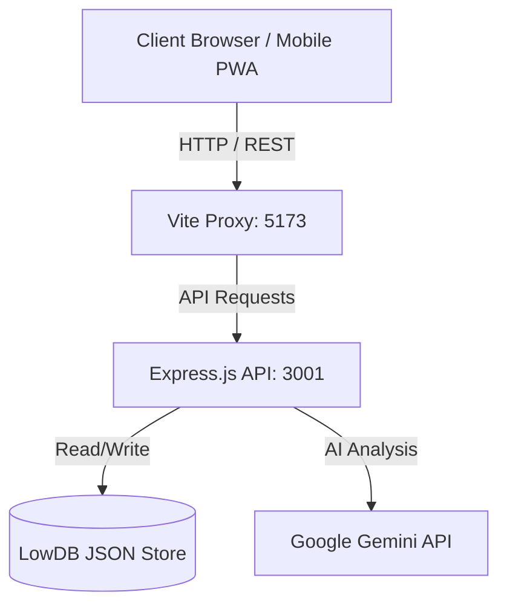

<div align="center">

# TaskFlow Pro: Life OS Edition

**A next-generation productivity ecosystem, task management platform, and complete Life OS.**

[](#)
[](LICENSE)
[](#)
[](#)
[](#)
[](#)

TaskFlow Pro merges industrial-grade security with a fluid, futuristic interface. More than just a task manager, it's a complete **Life OS** designed to orchestrate your work, health, finances, and habits in a single, cohesive environment.

[Features](#-key-features) •
[Life OS Ecosystem](#-life-os-ecosystem) •
[Architecture](#-architecture) •
[Installation](#-getting-started) •
[Roadmap](#-roadmap)

</div>

---

## Key Features

TaskFlow Pro goes beyond a simple to-do list, offering a comprehensive suite of tools designed to boost deep work and operational efficiency.

### Enterprise-Grade Security
* **JWT Authentication:** Secure, stateless, and persistent user sessions.
* **Bcrypt Cryptography:** Zero-knowledge architecture where passwords are mathematically hashed before reaching the database.
* **Isolated Workspaces:** Strict middleware protection ensures full multi-tenant data isolation.

### State-of-the-Art Interface
* **Glassmorphism Design System:** A translucent, immersive aesthetic leveraging `backdrop-blur` and ambient lighting effects.
* **Context-Aware Actions:** A dynamic global button that intelligently adapts its function based on the active module.
* **Global Ecosystem Search:** Search across all modules—tasks, habits, workouts, diet, and finances—from a single unified search bar.
* **Fluid Micro-interactions:** Cinematic layout transitions and drag-and-drop physics powered by **Framer Motion**.

### Mobile-First & PWA
* **Progressive Web App (PWA):** Install TaskFlow Pro directly on your iPhone or Android. Works just like a native app.
* **Responsive Interface:** Sidebar navigation (Drawer) optimized for small screens and touch gestures.
* **Quick Actions:** All modals and buttons have been refined for one-handed use, ensuring your Life OS is always in your pocket.

### Performance Analytics
* **Efficiency Engine:** Real-time monitoring of average task completion time, transformed into an efficiency percentage.
* **Data Visualization:** Interactive charts for weekly productivity and habit goals that adjust dynamically.

---

## Life OS Ecosystem

The **Life OS** expansion transforms TaskFlow Pro into a central command center for your personal development.

### Productivity & Work
* **Kanban Board:** High-performance task management with real-time status updates.
* **Pomodoro Engine:** Immersive focus timer with state-of-the-art UI for deep work sessions.

### Health & Performance
* **Workout Dashboard:** Track exercises, sets, and progress over time. Persistent history keeps your evolution visible.
* **Diet Tracker:** Log daily meals, monitor macro-nutrients (Protein, Carbs, Fats), and keep a historical log of your nutrition.

### Personal Finance & Goals
* **Finance Dashboard:** Complete transaction management (Income/Expense) with **AI-Powered Financial Analysis** via Google Gemini.
* **Goals Overview:** Define long-term objectives with a visual progress simulator to keep you motivated.

### Habits & Consistency
* **Habit Tracker:** Build and maintain discipline with a visual daily check-list and performance charts.

---

## Architecture & Tech Stack

This project is structured as a **Monorepo** using npm workspaces, enforcing strict separation of concerns between the API layer and the Presentation layer.



### Frontend (packages/web)
- **Framework:** React 18 + TypeScript
- **PWA Integration:** Vite PWA Plugin + iOS Standalone Support
- **Styling:** Tailwind CSS v4 + Vanilla CSS
- **Animation:** Framer Motion
- **Icons:** Lucide React
- **Data Viz:** Recharts (Productivity & Habit metrics)

### Backend (packages/api)
- **Environment:** Node.js
- **Framework:** Express.js
- **Persistence:** LowDB (File-based JSON Database)
- **AI Integration:** Google Generative AI (Gemini Flash 2.0)

---

## Getting Started

### Prerequisites
- [Node.js](https://nodejs.org/en/) (v18.0.0 or higher)
- npm (v9.0.0 or higher)

### 1. Clone & Install
```bash
git clone https://github.com/vrsebeatriz/TaskFlow.git
cd TaskFlow
npm install
```

### 2. Configure Environment
Create a `.env` file in `packages/api` (you can copy the `.env.example` file):
```env
GEMINI_API_KEY=your_key_here
JWT_SECRET=your_secret_here
PORT=3001
```

### 3. Run the Ecosystem
Open two terminals:
```bash
# Terminal 1: Backend
cd packages/api && node server.js

# Terminal 2: Frontend
cd packages/web && npm run dev -- --host
```

---

## Roadmap

- [x] Secure JWT Authentication & Password Hashing
- [x] Modernize UI with Glassmorphism System
- [x] Integrate robust Drag and Drop Task Management
- [x] Native Dark/Light Mode Engine
- [x] **Life OS Integration (Workouts, Diet, Habits, Finances, Goals)**
- [x] **AI-Powered Financial Insights**
- [x] **Unified Global Search Engine**
- [x] **Mobile-First Responsive Overhaul & PWA Support**
- [ ] Export Data to CSV/JSON for portability
- [ ] Collaborative Workspaces (WebSockets)

---

## Author

**Ana Beatriz Araújo** — Software Developer  
GitHub: [@vrsebeatriz](https://github.com/vrsebeatriz)

---

<div align="center">
  <sub>Built with ❤️ for a better, more organized life.</sub>
</div>
